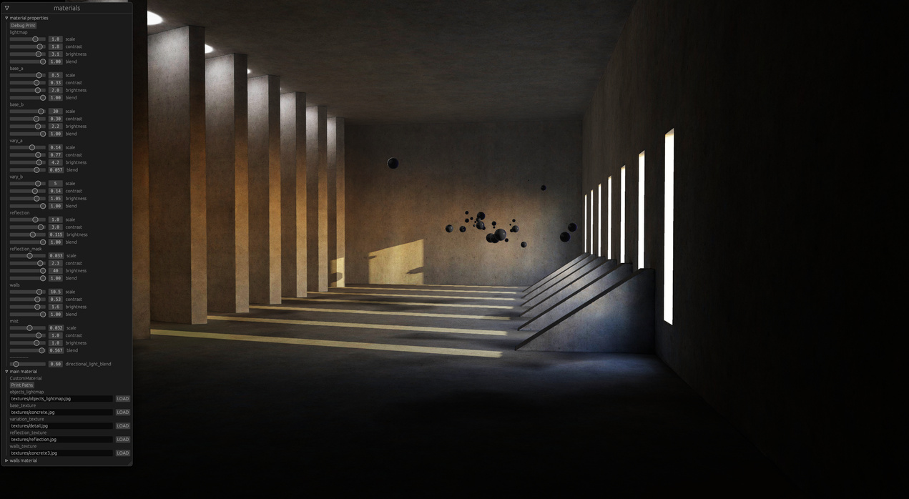

# Bevy Baked GI Demo
A demo scene with baked GI in Bevy

Video showing the baking and texturing process:
https://youtu.be/XhJ3bTOBDhI

I think there is a lot that can be improved in the demo project. Suggestions/PRs are welcome. I've mainly just been using this to test out various workflow/setup ideas.
